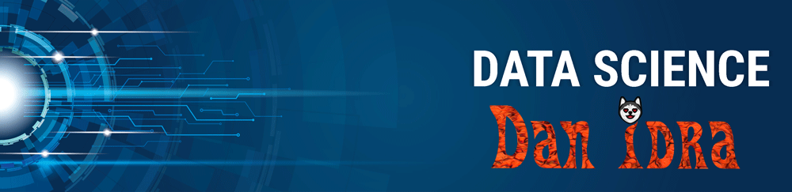

   

  

# Dan Idra
*Sócio Fundador* da Joyful Educação Financeira

Você não acha cansativo e totalmente padronizado estes resuminhos profissionais?

Por onde passei? O que estudei? Ou quem de fato eu sou? Você se conhece o suficiente pra dizer quem é? Eu me conheço.

Me formei em Administração na USP de Ribeirão Preto, tive o imenso prazer de ter participado da AIESEC como membro e do Núcleo de Emprendedores da FEA-RP/USP fiz toda escadinha: Membro>Coordenador de Projeto> Diretor de Projetos> Presidente > Conselheiro. O que mais aprendi aqui foi lidar e entender pessoas que são a base de toda organização.

Antes disso fiz dois anos de física no Instituto de Física da USP que me fez aprender um modelo mental lógico estruturado em modelos.

E hoje estudo Ciências de Dados e VFX compositing, o que faz todo sentido com nossa operação da Joyful de Educação. Ciências de Dados por me ensinar como funciona o aprendizado de modo profundo e VFX por me possibilitar criar conteúdos únicos pra nossos cursos.

Além disso cuidado das operações da Vithar que trabalha com marketplaces como Mercado Livre e Shopee.

Mas isso responde por onde passei, o que estudei, mas quem sou?

Sou aquele que olha no olho de todo ser que respira e entende que assim como eu tem direito a viver a melhor vida possível, ou seja ter bem-estar ou melhor inteireza(se quiser saber o que isso significa vai ter que comprar meu curso). Então minha missão é trabalhar pra aumentar o bem-estar do maior número possível de seres que respiram. Gosto de incomodar, ser espelho dos defeitos alheios, não nasci pra agradar, nasci pra dar a possibilidade das pessoas melhorarem. Não nasci pra julgar, como todo ser que tem um receptáculo humano, nasci para amar.

Claro que também conheço meus defeitos, são inúmeros, mas eu que não vou dar publicidade a eles, afinal burrice ou tolice não fazem parte deles.

E você quem é?

**Background in:** Python, Machine Learning, Space Operations and Mathematical Optimisation.

**Links:**
* [Blog](http://sigmoidal.ai)
* [LinkedIn](https://www.linkedin.com/in/carlosfab)
* [Medium](https://www.medium.com)

## Projetos:
Veja os tutoriais publicados:

* **Como usar o Histograma para Data Science:** https://bit.ly/2L2cMwy
* **Como Implementar Regressão Linear com Python:** https://bit.ly/2Li5pzY
* **Data Science: Investigando o naufrágio do Titanic:** https://bit.ly/2Ubr5SH
* **Como Tratar Dados Ausentes com Pandas:** https://bit.ly/31KWSMN
* **XGBoost: aprenda este algoritmo de Machine Learning em Python:** https://bit.ly/2UbRhws
* **Como criar uma Wordcloud em Python:** https://bit.ly/2OxsphM
* **Como lidar com dados desbalanceados:** https://bit.ly/2ZlaNsV
